# Verdict sistemi nasıl çalışır? — uçtan uca test yürüyüşü

**Kim için:** Operatör, ürün, test mühendisi (aşırı teknik değil).  
**Ne anlatır:** Nesy Mobile’da login → rota → schedule → 20 barkod → tur başlat → stop’lar senaryosunun **hedef** hali.  
**Durum:** Bu **hedef mimari**. Bugün SDK olayları ve Cockpit altyapısı büyük ölçüde var; Bridge’in **dokunma** katmanı ve Cockpit’in Maestro’suz akış motoru henüz tam değil.

İlgili planlar: [`CONDITION_ENGINE_AND_BRIDGEFLOW.md`](./CONDITION_ENGINE_AND_BRIDGEFLOW.md) · [`COCKPIT_SDK_BRIDGE_COMPAT_PLAN.md`](./COCKPIT_SDK_BRIDGE_COMPAT_PLAN.md) · Mobile `VERDICT_START.md` İz B.  
**Beş fazlı dürüst işletim modeli (hedef vs bugün):** [`OPERATING_MODEL.md`](./OPERATING_MODEL.md)
**90 gün hedef:** [`goals/G90-stabilization/RUN_PLAY.md`](./goals/G90-stabilization/RUN_PLAY.md) — north star beş madde. G90.2b `CODE_COMPLETE`; **NEXT G90.3.** Phase 10 plumbing ≠ live golden: [`goals/G90-stabilization/RESULT.md`](./goals/G90-stabilization/RESULT.md) §1.1. “Gerçekten stabil”: [`goals/G90-stabilization/ACCEPTANCE.md`](./goals/G90-stabilization/ACCEPTANCE.md).

---

## 1. Üç oyuncu, üç iş

| Oyuncu | Görevi | Benzetme |
|---|---|---|
| **Bridge** (ayrı APK) | Ekranda ne var? Şuraya dokun. | Gözler ve parmaklar |
| **SDK** (uygulamanın içinde) | İçeride ne oldu? Olay, DB, ağ | Sinirler |
| **Cockpit** (sunucu + UI) | Sırada ne? Bu doğru mu? | Beyin |

**Kritik kural:** Bridge karar vermez · SDK dokunmaz · Kararı Cockpit verir.

**Ekranı nasıl okur?** Her seferinde tüm ekranı tarama. Tek buton ararken yalnız o hedefe bakar; tüm sayfa ağacı yalnızca Inspector / hata repro gibi pahalı işler içindir (planda: `DumpScope`).

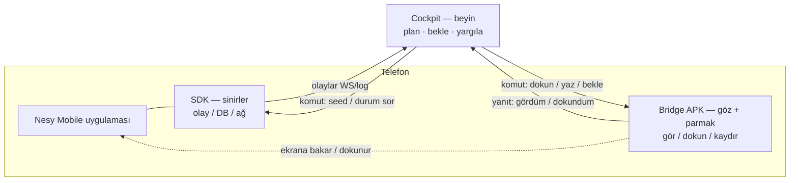

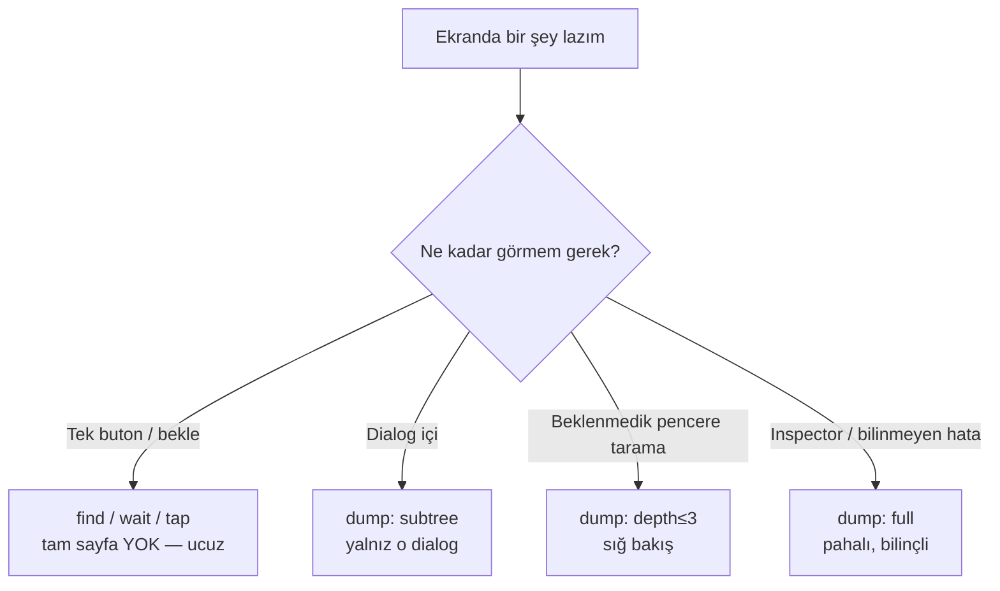

Bir şey bozulunca suçlu netleşir:

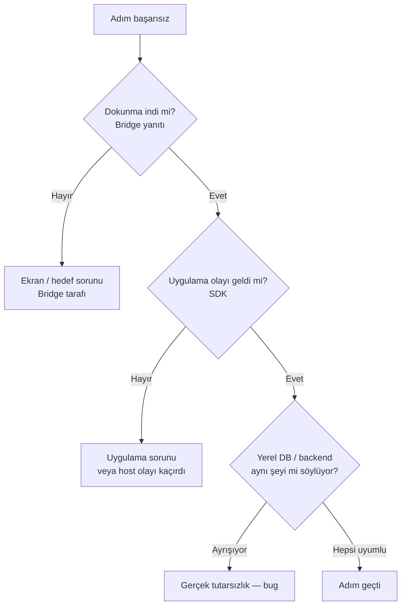

---

## 2. Dialog’lar için ayrı node açacak mıyız?

**Hayır — üç tür, üç ele alış.** Uygulama karmaşık olduğu için canvas’ı dialog’larla doldurmak işe yaramaz.

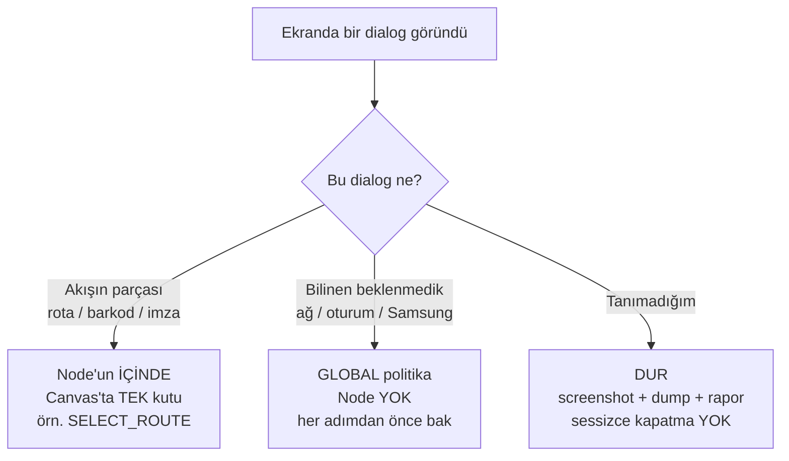

### Tür 1 — Akışın parçası → node’un içinde

Örnek: `SELECT_ROUTE` canvas’ta **bir** kutu; içinde:

1. Dialog açıldı mı?  
2. “36” listede var mı? (gerekirse kaydır)  
3. Seç  
4. Dialog kapandı mı?

### Tür 2 — Beklenmedik → global politika (örnek)

| Dialog | Politika |
|---|---|
| Ağ hatası | “Tekrar Dene” → aynı adımı yinele |
| Oturum uyarısı | Testi **durdur** (gerçek bug / ortam) |
| Uyumluluk / “bir daha gösterme” | İşaretle, devam et |
| Tanınmayan | **DUR** — kapatmaya çalışma |

### Tür 3 — Tanınmayan → asla sessiz geçme

Bilinmeyen dialog ya yeni özellik ya bug; “X’e bas geç” ile örtülmez.

---

## 3. Test yazar iken: Live Inspector

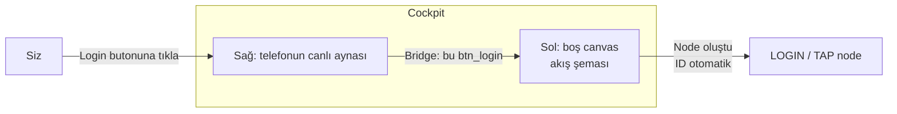

ID ezberlemezsiniz, koda bakmazsınız: **gördüğünüz butona tıklarsınız**, sistem kimliği öğrenir.

### 3.1 Örnek: “Listede şu shipment’ı bul ve içine gir”

Senaryo: Stop listesinde / parcel listesinde **belirli bir shipment id** (ör. `32562939073268`) görünsün, satıra girilsin. Brain (Cockpit) bunu iki aşamada yapar: **bir kez sen yazarsın**, **sonra motor her koşuda tekrarlar**.

#### A) Yazarken (Live Inspector — bir kez)

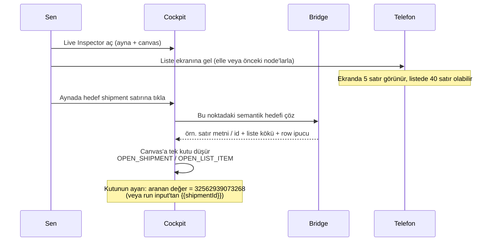

Ne öğrenilir (sizin ezberlemenize gerek yok):

| Parça | Örnek | Ne işe yarar |
|---|---|---|
| Liste kökü | RecyclerView / stop list container | “Hangi listede arayacağım?” |
| Satır kimliği | metin / barkod / resource | “Ne arıyorum?” |
| Satır tipi | collection row | `@row` / kaydırma için |

Canvas’ta **bir kutu** görürsünüz: `Listeden shipment aç` — içinde “bul + kaydır + dokun” gizlidir (ayrı 5 node değil).

#### B) Koşarken (Brain — her seferinde)

Brain **tüm listeyi dump etmez**. Sırayla ucuz sorular sorar:

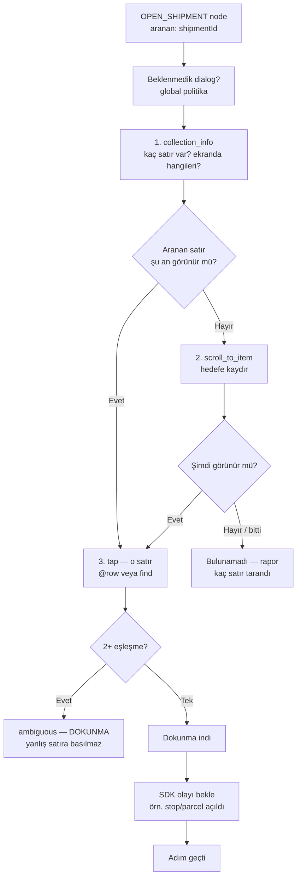

| Adım | Kim | Ne | Dump? |
|---|---|---|---|
| 1. Liste özeti | Bridge `collection_info` | “40 satır var, ekranda 0–4” | Tam sayfa **yok** |
| 2. Kaydır | Bridge `scroll_to_item` | Hedef metin/id görünene kadar | Tam sayfa **yok** |
| 3. Dokun | Bridge `tap_text` / `tap_id` (+ `@row=N` gerekirse) | Tek satır | Tam sayfa **yok** |
| 4. Doğrula | SDK olay + isteğe bağlı DB | İçeri girildi mi? | — |

**Brain’in kararı (Cockpit):** “Hâlâ görünmüyor → bir kez daha kaydır” / “ambiguous → dur” / “dokundum, olay gelmedi → hangi katman?”. Bridge sadece göz+parmak; SDK sinir; karar Cockpit’te.

#### C) Neden “yüzlerce elementi çek” değil?

| Yanlış yol | Doğru yol |
|---|---|
| Her denemede `dump: full` → 500 node JSON | `collection_info` + `scroll_to_item` + `tap` |
| Ekranda görünen ilk benzer metne bas (`nodes[0]`) | Tek eşleşme veya `@row=N`; 2+ → **ambiguous, dokunma** |
| 40 satır için 40 node | **Bir** `OPEN_SHIPMENT` + run input `{{shipmentId}}` |

#### D) Süre (tahmini)

| Durum | Tipik |
|---|---|
| Satır zaten ekranda | **1–3 sn** |
| Birkaç kaydırma ile bulunur | **3–10 sn** |
| Çok uzun liste / yavaş liste | **10–25 sn** |
| Yok / ambiguous | Fail — süreyi uzatmak yerine net hata |

**Uzar nedenleri:** liste virtualize + yavaş bind, aranan id listede yok (veri), aynı barkod iki satırda (ambiguous), beklenmedik dialog.

#### E) Run input ile esnek kullanım

Aynı node, farklı koşularda farklı shipment:

```text
OPEN_SHIPMENT
  list:   (Live Inspector’dan öğrenilen liste kökü)
  match:  {{shipmentId}}     ← koşu başında verilir
  action: open / tap row
```

20 farklı shipment = 20 node değil; **FOR_EACH** veya ardışık run input.

Teknik sözleşme: [`CONDITION_ENGINE_AND_BRIDGEFLOW.md`](./CONDITION_ENGINE_AND_BRIDGEFLOW.md) §5.2.

---

## 4. Sizin senaryo — baştan sona

### Büyük resim

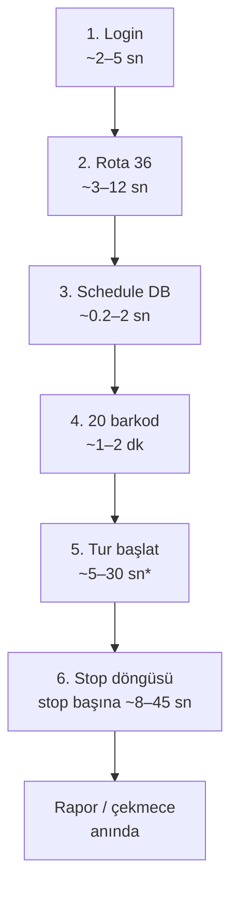

\* Dispatcher’ı Cockpit otomatik onaylarsa kısa; gerçek insan beklenirse dakikalar.

### Süre rehberi (benchmark tahmini)

Bunlar **lab / stage ortamı için ortalama tahmin**; ölçülmüş SLA değil. Hedef mimaride olay bekleme milisaniye–saniye; Maestro’daki “kör 15 sn bekle” maliyetinin çoğu düşer. Uzarma nedenleri operatörün çekmecede göreceği şeylerdir.

| Adım | Tipik (mutlu yol) | Makul üst | Toplam senaryoya katkı | En sık uzama nedeni |
|---|---|---|---|---|
| 1. Login | **2–5 sn** | ~15 sn | Küçük | Splash, clearState, yavaş auth API |
| 2. Rota seç | **3–8 sn** | ~20 sn | Orta | Rota dialog geç açılır; uzun listede kaydırma |
| 3. Schedule DB | **0.2–1 sn** | ~5 sn | Çok küçük | Sync henüz bitmedi; tekrar sorgu |
| 4. 20 barkod | **~3–5 sn × 20 ≈ 1–2 dk** | ~4–5 dk | **Büyük dilim** | Tip başına ekstra dialog; geçersiz barkod; scanner gecikmesi |
| 5. Tur başlat | **5–15 sn** (otomatik onay) | 30–60 sn+ | Değişken | Backend / bildirim gecikmesi; refresh sonrası sync |
| 6. Stop × N | **teslim ~20–45 sn · pick ~15–30 sn · failed ~8–15 sn** | stop × 1–2 dk | **En büyük dilim** | İmza/foto/ödeme; harita; offline kuyruk bekleme |
| *(her adım öncesi)* Dialog politikası turu | **&lt;0.5 sn** (yoksa) | +3–10 sn (bilinen dialog) | Küçük ama birikir | Ağ uyarısı tekrarları |
| **Uçtan uca (ör. 8 stop)** | **~8–15 dk** | **20–40 dk** | — | Ağ + foto + uzun rota listesi + insan dispatcher |

**Okuma ipucu:** “Tipik” = her şey ilk denemede geçer, stage ayakta, Bridge dokunuşu temiz. “Makul üst” = bir kez retry / yavaş sync hâlâ test sayılır. Bunun sahası = genelde bug veya ortam (çekmece katmanına bak).

Motor her adımda aynı döngüyü koşar (düz liste değil):

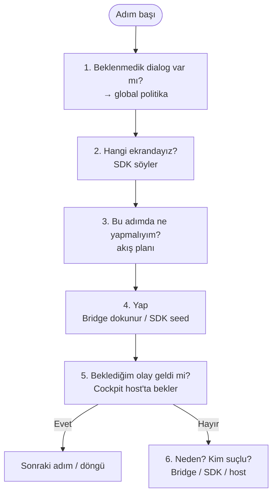

---

### Adım 1 — Login

| | |
|---|---|
| **Tipik süre** | **2–5 sn** (PIN + dokun + login olayı) |
| **Seed / programatik login** | **&lt;1–2 sn** (ekrana az dokunulur; olay + durum yeterliyse) |
| **Makul üst** | ~10–15 sn |

| Kim | Ne yapar |
|---|---|
| Cockpit | “PIN yaz, `btn_login`’e bas” |
| Bridge | Kutuyu bul → görünür/üstü kapalı mı → yaz → dokun |
| SDK | `STATE_LOGIN` (veya eşdeğer login olayı) yayınlar |
| Cockpit | Olayı bekler; gelmezse Bridge yanıtına bakıp katmanı söyler |

**Neden uzar?**

| Neden | Kimin sahası | Ne görürsünüz |
|---|---|---|
| Splash / ilk açılış uzun | Uygulama | Dokunma gecikir; login butonu geç görünür |
| `clearState` ile soğuk açılış | Test kurulumu | Her şey sıfırdan; +birkaç sn normal |
| Auth / token API yavaş veya 5xx | Backend | Dokunma indi, olay geç veya yok |
| Yanlış PIN / klavye / overlay | Ekran | Bridge “üstü kapalı” veya dokunma fail |
| Zaten login’li cihaz (yanlış varsayım) | Planlama | Gereksiz PIN turu veya atlanan dal |

```mermaid
sequenceDiagram
  participant C as Cockpit
  participant B as Bridge
  participant A as Uygulama
  participant S as SDK

  C->>B: PIN yaz + btn_login dokun
  Note over B: tipik 0.3–1 sn (bul + dokun)
  B->>A: gerçek dokunma
  A->>S: login işi
  S-->>C: STATE_LOGIN
  Note over C: olay genelde &lt;1 sn; API yavaşsa uzar
```

---

### Adım 2 — Rota dialog’u (`SELECT_ROUTE` = tek kutu)

| | |
|---|---|
| **Tipik süre** | **3–8 sn** (dialog + 36 görünür + seç + olay) |
| **36 ekranda değilse (kaydır)** | **+2–8 sn** (liste boyuna göre) |
| **Makul üst** | ~15–20 sn (bugün Maestro’da dialog bekleme bu bandda yanabiliyor) |

İç işler (canvas’ta dört kutu değil):

1. Dialog açıldı mı? (Bridge + mümkünse SDK `DIALOG_SHOWN`)  
2. “36” görünür mü? Liste uzunsa Bridge “50 satır var, şimdi 0–4 ekranda” diyebilir → kaydır  
3. Seç  
4. SDK: `ROUTE_SELECTED` / `STATE_ROUTE`

**Neden uzar?**

| Neden | Kimin sahası | Ne görürsünüz |
|---|---|---|
| Stop list / rota spinner geç gelir | Uygulama + ağ | Dialog 10+ sn sonra; “henüz yok” ≠ “yok” |
| Rota listesi çok uzun, 36 altta | Ekran / veri | Birden fazla kaydırma turu |
| Seed ile rota seçilebiliyorsa dokunma atlanır | Plan (iyi yol) | **Kısalır** (~1–3 sn) |
| Yanlış rota / dialog kapanmaz | Uygulama | Olay gelmez; Bridge hâlâ dialog görür |
| Flavor’da rota zorunlu değil | Ülke / config | Adım anlamsız uzar veya atlanmalı |

```mermaid
sequenceDiagram
  participant C as Cockpit
  participant B as Bridge
  participant S as SDK

  C->>B: dialog / rota 36 bul veya kaydır
  Note over B: 1–10 sn (spinner + kaydırma)
  C->>B: 36'ya dokun
  S-->>C: ROUTE_SELECTED + STATE_ROUTE
  Note over S,C: olay tipik &lt;1 sn
```

---

### Adım 3 — Schedule DB’de oluştu mu?

Burada **Bridge yok** — ekrana bakılmıyor.

| | |
|---|---|
| **Tipik süre** | **0.2–1 sn** (tek okuma + karşılaştır) |
| **Makul üst** | ~3–5 sn (birkaç kez yeniden sor) |

| Kim | Ne yapar |
|---|---|
| SDK | Uygulama DB’sine **salt okuma**: schedule var mı, durum ne? |
| Cockpit | Beklenenle karşılaştırır |

**Neden uzar?**

| Neden | Kimin sahası | Ne görürsünüz |
|---|---|---|
| Rota sonrası sync henüz DB’ye yazmadı | Uygulama / zamanlama | İlk okuma boş → kısa poll (1–2 sn aralık) |
| Yanlış courier / rota / ülke verisi | Test verisi | Hiç dolmaz → timeout (bu “yavaş” değil, fail) |
| Cihaz meşgul / GC | Cihaz | Nadir; okuma genelde ucuz |

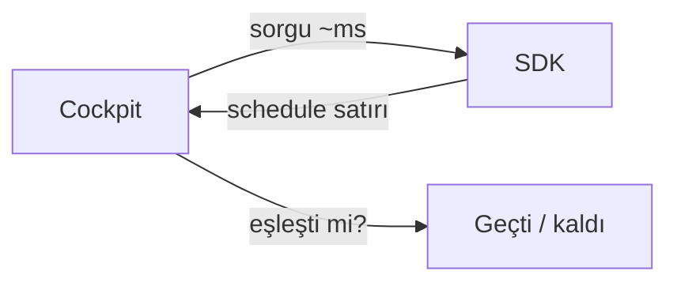

---

### Adım 4 — 20 barkod → **bir döngü node’u** (20 node değil)

| | |
|---|---|
| **Barkod başına tipik** | **3–5 sn** (dialog aç → yaz → onay → olay) |
| **20 barkod toplam** | **~1–2 dk** |
| **Makul üst (20)** | **~3–5 dk** (tip çeşitleri + 1–2 retry) |

```text
Barkod listesi (20, farklı shipment tipleri)
Her biri için:
  barkod dialog’unu aç
  yaz → onayla
  PARCEL_SCANNED (veya eşdeğer) bekle
  sonuç: başarılı / zaten zimmetli / geçersiz → kaydet
```

**Neden uzar?**

| Neden | Kimin sahası | Ne görürsünüz |
|---|---|---|
| Shipment tipine göre ekstra alan / dialog | Ürün akışı | Bazı satırlar 8–12 sn |
| “Zaten zimmetli” / geçersiz → uyarı kapat | Veri + politika | +2–5 sn / barkod; döngü devam edebilir |
| Klavyenin geç gelmesi / focus kaybı | Ekran | Yazma adımı tekrarı |
| Backend stoplist güncellemesi her scan’de | Ağ | Olay geç; Local OK Remote geç |
| 20 ayrı node yazılmış olsaydı (eski alışkanlık) | Tasarım hatası | Bakım + sahte bekleme maliyeti (bu yüzden FOR_EACH) |

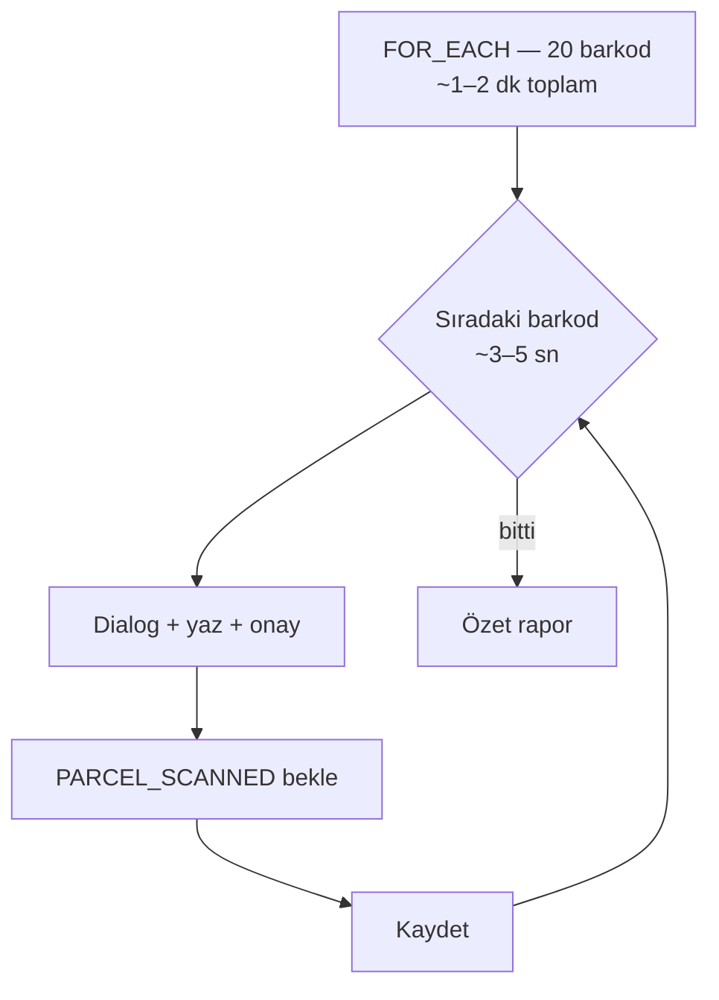

---

### Adım 5 — Tur başlat + dispatcher + refresh

| | |
|---|---|
| **Tipik (Cockpit otomatik dispatcher onayı)** | **5–15 sn** |
| **Bildirim + pull-refresh + DB/backend üçlü doğrulama** | çoğu bu bandın içinde |
| **Makul üst** | **30–60 sn** |
| **Gerçek insan dispatcher beklerseniz** | **dakikalar** — CI için önerilmez |

```mermaid
sequenceDiagram
  participant C as Cockpit
  participant B as Bridge
  participant S as SDK
  participant BE as Backend

  C->>B: Request Tour Start dokun
  Note over B: ~0.5–1 sn
  S-->>C: istek gitti
  C->>BE: Dispatcher onayı (test host)
  Note over C,BE: otomatik ~1–5 sn; insan = ???
  BE-->>S: bildirim / durum
  C->>B: Pull-to-refresh
  Note over B: jest ~1–2 sn
  S-->>C: TOUR_STARTED + schedule güncellendi
  C->>C: Olay + DB + backend aynı mı?
```

Üçü ayrışıyorsa “ekranda yeşil göründü” yetmez — gerçek bug.

**Neden uzar?**

| Neden | Kimin sahası | Ne görürsünüz |
|---|---|---|
| Dispatcher onayı gecikir | Backend / süreç | App olay var, Remote yok |
| Push / bildirim cihaza geç düşer | Platform / ağ | Refresh erken → eski schedule |
| Pull-to-refresh sonrası sync uzun | Uygulama | Ekran yeni, DB eski (veya tersi) |
| Stage kapalı / yavaş | Ortam | 30 sn+ timeout bandı |
| İnsan onayı beklenen senaryo | Bilinçli seçim | Benchmark dışı; “bekleme testi” ayrı yazılmalı |

---

### Adım 6 — Stop’lar: deliver / pick / failed

Her stop farklı iş; dialog’lar yine **node değil**, aksiyonun iç tarifi.

| Stop türü | Tipik süre / stop | Makul üst | Not |
|---|---|---|---|
| **Delivery failed** (sebep seç) | **8–15 sn** | ~30 sn | Az dialog |
| **Pickup** | **15–30 sn** | ~45 sn | Tip / ekstra alan |
| **Deliver** (imza ± foto ± ödeme) | **20–45 sn** | **1–2 dk** | Medya ve ödeme uzatır |
| **8 stop karışık tur (örnek)** | **~3–6 dk** | **10–15 dk** | En pahalı dilim genelde burası |

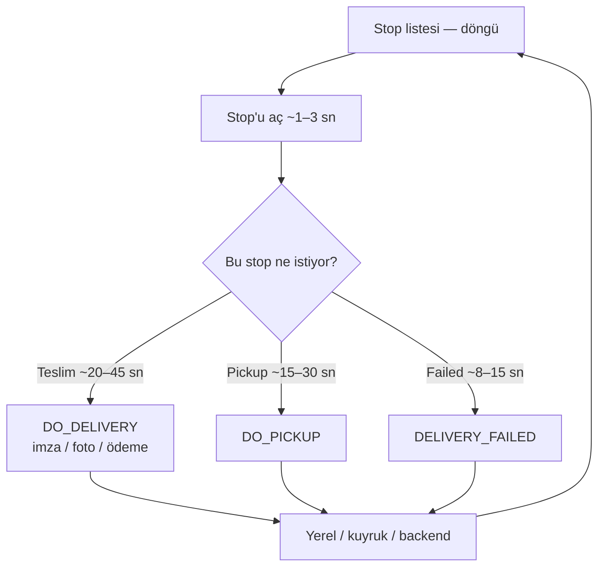

**Offline önemli:** “Yerel yazıldı, istek kuyrukta” ≠ “Backend 200”. İkisi de normal saha davranışı olabilir; raporda **ayrı** görünmeli (`QUEUE_OFFLINE` hata sayılmaz).

**Neden uzar?**

| Neden | Kimin sahası | Ne görürsünüz |
|---|---|---|
| Kamera / galeri / imza pad | Ekran + cihaz | UI adımı uzun; olay sonra |
| Ödeme / COD ek ekranı | Ürün | Deliver bandı 45 sn+ |
| Harita / navigasyon parçası açılır | Uygulama | Stop açılışı şişer |
| Offline kuyruk + sonra sync beklemek | Ağ / senaryo | Local ✅ Remote gecikir — fail sayma |
| Beklenmedik dialog (ağ, oturum) her stop’ta | Politika | +birkaç sn × N stop |
| Stop sayısı (20 stop) | Veri | Süre neredeyse doğrusal artar |

---

### Uçtan uca süre özeti (örnek paket)

Varsayım: stage ayakta · otomatik dispatcher · 20 barkod · **8 stop** (4 deliver, 2 pick, 2 failed) · beklenmedik dialog yok veya seyrek.

| Dilim | Tipik | Zor gün |
|---|---|---|
| Login + rota + DB | ~10–20 sn | ~45 sn |
| 20 barkod | ~1–2 dk | ~4 dk |
| Tur başlat | ~10 sn | ~45 sn |
| 8 stop | ~3–6 dk | ~12 dk |
| **Toplam** | **~6–10 dk** | **~15–20 dk** |

Maestro’lu bugünkü koşular çoğu zaman **daha uzun** görünür (kör bekleme, sabit timeout, tekrarlayan YAML). Hedef motorda süre “daha hızlı olmak için” değil; **boşa beklemeyi kesip uzamayı gerçek nedene bağlamak** için düşer.

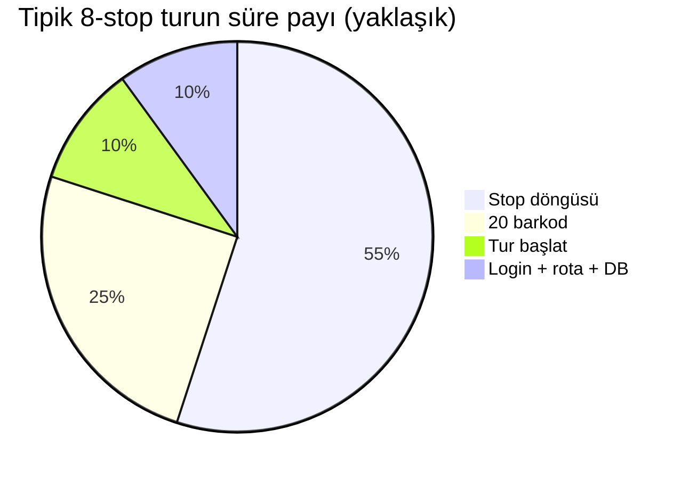

---

## 5. Test bitince ne görürsünüz?

Canvas üzerinde (yalnız ilgili katmanlar — her node’da zorunlu 4 rozet yok):

```text
[Teslim Et]  👆✅  ⚡✅  💾✅  ☁️❌
```

| Rozet | Anlam |
|---|---|
| 👆 UI | Dokunma indi, görünür, üstü kapalı değil |
| ⚡ App | Uygulama olayı geldi |
| 💾 Local | Room / yerel kayıt |
| ☁ Remote | Backend onay — yoksa offline kuyruk ayrı okunur |

Kutuya tıklayınca **çekmece** (şelale — ortak saat ile):

```text
0.00s  Komut: btn_deliver'a dokun
0.05s  👆 Dokunma indi. Görünür. Üstü kapalı değil.
0.17s  ⚡ Teslimat olayı
0.42s  💾 Yerel: DELIVERED
5.42s  ☁️ Backend 503 / zaman aşımı
```

“Test patladı” değil → **hangi katman** patladı.

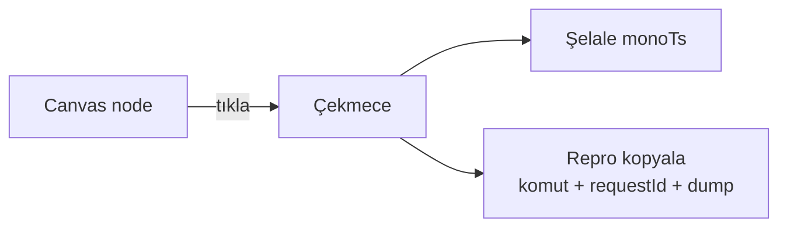

---

## 6. Özet tablo — kim ne yapar?

| İş | Bridge | SDK | Cockpit |
|---|:---:|:---:|:---:|
| Ekranda ne var | ✅ | | |
| Dokun / yaz / kaydır | ✅ | | |
| Görünür mü / üstü kapalı mı | ✅ | | |
| Liste kaç öğe (kaydırma kararı) | ✅ | | |
| Hangi ekrandayız | | ✅ | |
| Hangi olay oldu | | ✅ | |
| Uygulama DB okuma | | ✅ | |
| Ağ / hata / süre | | ✅ | |
| Çökme / donma sinyali | | ✅ | |
| Sırada ne yapılacak | | | ✅ |
| Beklenmedik dialog politikası | | | ✅ |
| Backend / dispatcher doğrulama | | | ✅ |
| Geçti / kaldı kararı | | | ✅ |

**Basit kural:** Dışarıdan görünen → Bridge · İçeride olan → SDK · Karar ve yargı → Cockpit.

---

## 7. Bugün vs hedef

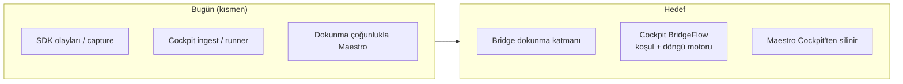

| Hazırlığa yakın | Henüz hedef |
|---|---|
| SDK olayları, DB okuma yolu, ağ izi | Bridge: gerçek dokunma + `visible` / üstü kapalı |
| Cockpit veri alma, workflow editör | Cockpit: Maestro yerine kendi akış motoru |
| Live Inspector’ın bir kısmı (gözlem) | Tıkla→node + çekmece + 4 rozet olgun UI |

---

## 8. Bu senaryonun canvas özeti (node listesi)

Dialog’lar ayrı node değil; döngüler tek kutu:

| # | Canvas’ta gördüğünüz | Tipik süre | İçinde / not |
|---|---|---|---|
| 1 | Login / Auth | 2–5 sn | PIN + buton (Live Inspector’dan) |
| 2 | Select Route | 3–8 sn | Dialog + rota 36 + kapanış |
| 3 | Validate schedule (DB) | &lt;1 sn | Bridge yok — SDK okuma |
| 4 | **For each barcode × 20** | **1–2 dk** | Tek kutu; rapor 20 satır |
| 5 | Request tour start | 5–15 sn* | Dokun + host dispatcher + refresh |
| 6 | **For each stop** | 8–45 sn / stop | Deliver / Pick / Failed — dialog içeride |
| — | *(ayar)* Dialog politikası | &lt;0.5 sn / adım | Canvas dışı sekme |

\* Otomatik dispatcher; insan onayı = dakikalar (CI’da kaçının).

---

*Son güncelleme: 2026-07-29 — operatör anlatımı + diyagramlar. Uygulama detayı için CONDITION_ENGINE ve üst uyum planına bakın.*
